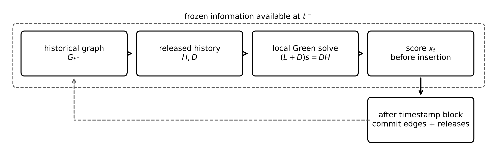

# Green Fraud Fields

Code for causal Green-field graph features in fraud and illicit-transaction ranking.

## Main idea

Fraud labels arrive late, but entity histories repeat. The code turns released fraud history into graph features without letting future labels or candidate edges leak into the score. At each scoring time, it builds history from labels that have already been released and computes adaptive Green-risk fields of the form

```text
S_D = (L + D)^-1 D H
```

where `H` is released endpoint history, `D` is a nodewise confidence/precision matrix, and `L` is a graph Laplacian built from historical edges.



The repo is intentionally small. It keeps the package code, tests, final experiment runners, figures, and experiment manifests. Raw datasets and generated experiment outputs are not committed.
The frozen result manifest is `manifests/ieee_green_block_causal_manifest.json`; it records the settings and result-summary hashes used for the reported tables and figures.

The final code covers:

- strict timestamp-block causality for IEEE-CIS;
- graph-vs-history ablations;
- label-delay sweeps;
- leakage and label-release audits;
- label-permutation placebo checks;
- calibration, posterior-uncertainty, warm-start, and bootstrap diagnostics;
- a small Elliptic++ external check.

## Datasets

The datasets are public but are not redistributed here.

- IEEE-CIS Fraud Detection, Kaggle competition: <https://www.kaggle.com/c/ieee-fraud-detection>
- Elliptic++ Bitcoin transaction and wallet graph data: <https://github.com/git-disl/EllipticPlusPlus>

IEEE-CIS can be downloaded with the Kaggle API after accepting the competition rules:

```powershell
python scripts/download_ieee_cis.py
```

Elliptic++ is mirrored by its authors on Google Drive from the project README. The GitHub repository currently stores large CSVs through Git LFS, so use the public mirror if LFS quota is unavailable.

## Install

From the repo root:

```powershell
python -m pip install -e .
python -m pytest
```

## Reproduce the main runs

The runners write to `outputs/`. The important ones are:

```powershell
# Build strict block-causal IEEE-CIS feature caches.
python scripts/build_green_block_causal_features.py
python scripts/build_adaptive_precision_block_causal.py

# Reviewer-gate ablations.
python scripts/run_green_review_graph_history.py
python scripts/run_green_review_delay_sweep.py

# Causality checks and robustness diagnostics.
python scripts/run_green_leakage_audit.py
python scripts/run_green_permutation_placebo.py
python scripts/run_green_calibration_check.py
python scripts/run_green_posterior_uncertainty.py
python scripts/run_green_warmstart.py
python scripts/run_green_final_bootstrap_ci.py --replicates 2000
python scripts/write_green_frozen_manifest.py
python scripts/verify_green_frozen_manifest.py

# External Elliptic++ checks.
python scripts/run_ellipticpp_strict_smoke.py
python scripts/run_ellipticpp_exact_green.py --radius 1 --cap 50
python scripts/run_ellipticpp_exact_green.py --radius 2 --cap 50
python scripts/run_ellipticpp_exact_green_combo.py

# Figures.
python scripts/plot_green_field_scheme.py --output-dir figures
python scripts/plot_delay_auc_sweep.py --output-dir figures
```

For a quick synthetic sanity check instead of the full Kaggle data:

```powershell
python scripts/make_smoke_ieee_data.py
python scripts/build_green_block_causal_features.py
python scripts/build_adaptive_precision_block_causal.py
python scripts/run_green_review_graph_history.py
```

## Main empirical takeaway

On IEEE-CIS, adaptive Green-risk features add measurable ranking signal beyond raw released history under strict timestamp-block causality, and tail-ranking models remain positive across simulated label-release delays.

The frozen evaluation uses validation-selected pointwise tail scores and deterministic chronological tie-breaking at alert cutoffs. The standalone graph marginal is more stable for P@1% than for AUC-PR across windows; continuous-state warm-start results are positive but weaker than reset-window results.

On Elliptic++, raw released address history transfers well, but exact local smoothing does not beat the strongest raw-history baseline under the tested address-graph design. We treat that as a useful high-confidence-regime check rather than as a second positive Green-smoothing validation.

## Repository layout

```text
src/green_fraud_fields/   core graph, history, modeling, and causal feature code
scripts/                  final experiment runners and figure script
tests/                    unit tests for causal and Green-field components
figures/                  committed figures
manifests/                experiment manifest, result hashes, and environment notes
```

## License

MIT. See `LICENSE`.
